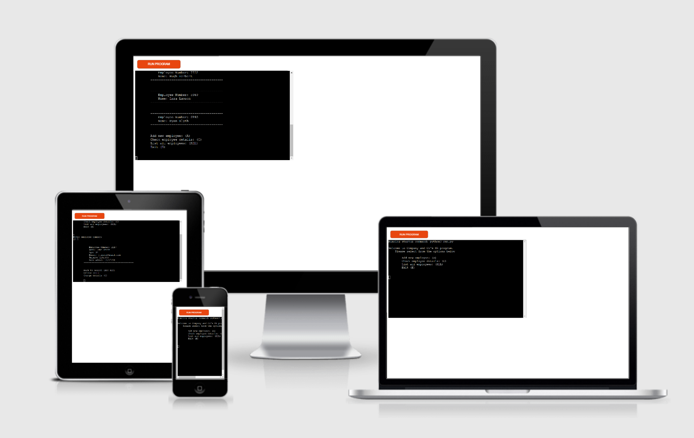

# Company and Co - HR Application

This command line program is a Python based, object oriented program that would allow for a small company to keep track of their employee's information and access specific info as and when needed. The program pushes to a Google Sheet which can be manipulated from inside the program. Data can be added, deleted, and modified. Along with this, salaries can be set using predefined boundaries or set manually. To access the [Google Sheet](https://www.google.co.uk/sheets/about/), follow the link, click 'Go to Google Sheets' and login using:

  - Email: rb.test.codeinstitute@gmail.com
  - Password: hrappcodeinstitute

In this theoretical company, employees added to the system are randomly generated a 4 digit employee number. This allows them to easily find their information on the system.

## User Experience (UX)

### User Stories           
- First time visitor goals:
  - To be able to intuitively navigate the program and complete tasks easily and quickely.

- Returning visitor goals
  - To learn how the program operates, navigate and control data faster and easier over time.

- Frequent user goals
  - To see updates to the program covering checks on email inputs, auto age complete using birthdates rather than explicit age inputs.

- Site owner goals 
  - To create a simple to use, easy to navigate program that would allow a theoretical company to process employees into a list external from the program and store data neccessary for regular company buisness needs.

## Features

### Existing features
- User input at every step to walk the user through how the program operates without them having to write any complicated lines of text/code.

- Preset salary brackets for 3 levels of seniority, and the option to input a different amount manually.

- Two levels of employee location, basic and specific. Using the ALL command, a user can find an employee's number and use that to locate their specific information to delete or modify.

### Features to be implimented 

- Email verification that will only add the inputed data into the sytem if it contains an '@' symbol and a '.com'.

## Languages Used

- Python

## Frameworks used

- Git
- GitHub
- Google Sheets API
- Google Drive API

## Testing

- The Python code passes through the PEP8 linter with no major issues.
    - [PEP8 Linter](http://pep8online.com/) 

- During development, code was written to give the correct output when the correct input was given. Once that was working, invalid inputs were fed into the program to see how it reacted. Most bugs in the code were resolved this way. Furthermore, print statements and breakpoints were used when an error was harder to resolve. 'Try, except' blocks were used for ValueErrors and displayed to the user in short, sharp explanations to convey the issue quickely.

### Known bugs
- The program handles invalid inputs for most instances when the user is prompted. However when updating information on a current employee, the age can be set to any input, not just an integer.

- It is possible for more than one employee to be generated the same random number. A fix was attempted during development but ultimately left out as more important sections of the program were still far from completed.

## Further testing

### Deployment 
## Creating the Heroku app

- The project was deployed using Heroku.
- Two buildpacks were added from the _Settings_ tab. The ordering is as follows:

1. `heroku/python`
2. `heroku/nodejs`

- A _Config Var_ called `PORT` was created and set to `8000`
- A second _Config Var_ was created called `CREDS` and set to the contents of the JSON file.

- The prject was connected to the GitHub repository and deployed.

- You can view the live site [here]().

## Credits 

### Content
- Code
  - Code not covered in the lessons leading up to this project were researched and found on [Stack Overflow](https://stackoverflow.com/) and [W3Schools](https://www.w3schools.com/tags/default.asp).

- Content
  - All Python code was written by the developer.
  - HTML and CSS is template code written by Code Institute.

### Acknowledgements
    
- Tutor support at Code Institute for all their support throughout.

- Friends and family for viewing the site and giving feedback.